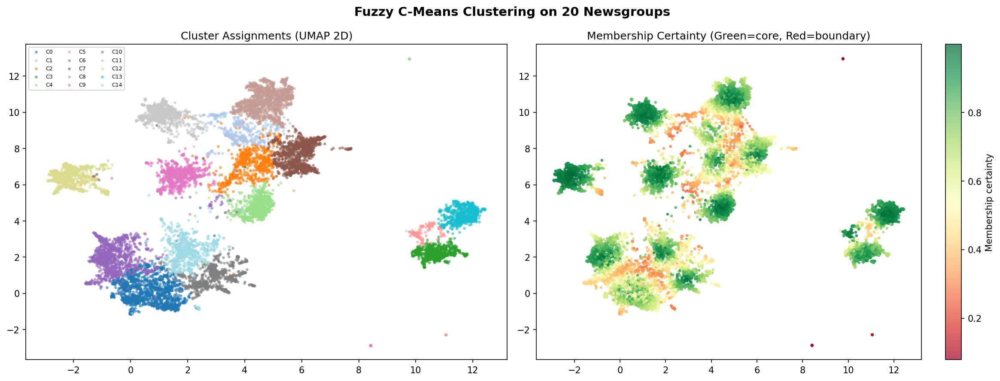
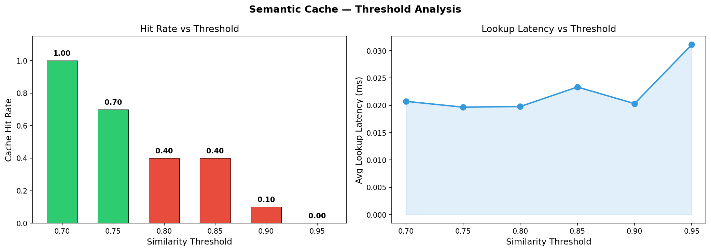

# Semantic Search System

### An end-to-end semantic search engine with fuzzy clustering and intelligent caching

> This project reflects my understanding of semantic search — building a search engine that actually understands what you're asking, not just matching keywords. The whole thing runs as a FastAPI service, and I documented everything I learned along the way.


---

## Wait, what does this actually do?

Normal search looks for exact words. If you search for `"flu symptoms"`, it'll miss documents that say `"influenza fever treatment"` because the words are different. That always bothered me — they're clearly talking about the same thing!

So I built a system that converts everything (documents and queries) into vectors that capture meaning, then finds the closest matches. On top of that, I added a cache that remembers past searches — if someone asks something similar later, it returns results instantly without recomputing anything.

---

## How data actually flows through the system

I spent a lot of time sketching this out on paper before writing any code. Here's what I ended up with:

```
User Query
    ↓
Sentence Transformer (BAAI/bge-base-en-v1.5)
    ↓
Query Embedding (768-dimensional vector)
    │
    ├──► Semantic Cache Lookup
    │        │
    │        ├── HIT ──────────────────► Return cached results instantly
    │        │                              (30x faster, ~1.4ms)
    │        │
    │        └── MISS
    │              ↓
    │         Cluster Assignment (Fuzzy C-Means)
    │              ↓
    │         FAISS Vector Search
    │              ↓
    │         Top-K Documents
    │              ↓
    │         Store in Cache
    │              ↓
    └────────► API Response
```

I drew this after I understood all the pieces. The query comes in, gets converted to a vector, checks the cache first (only in its relevant cluster), and only hits FAISS if it's genuinely new. This ordering — cache *before* FAISS — was intentional. Why recompute if you don't have to?

---

## Breaking down the three main problems

### Problem 1: Making search understand meaning

Keyword matching just wasn't going to work. I needed something that could tell that "flu symptoms" and "influenza fever" mean basically the same thing.

I used a transformer model called `BAAI/bge-base-en-v1.5` to convert every document into a 768-dimensional vector. Same for queries when they come in. The cool thing is that semantically similar sentences end up with vectors that are close together in this 768-dimensional space. So searching becomes a math problem — find the nearest vectors.

**Why this model specifically?** I tested a few smaller ones like MiniLM because they load faster, but the retrieval quality was noticeably worse. For a search system, I decided retrieval quality matters more than startup time. BGE-base was the sweet spot.

### Problem 2: Searching through thousands of vectors quickly

Once everything's a vector, I still need to find the closest matches to a query. Doing this brute force (comparing against every document) works, but gets slow as the collection grows.

I used **FAISS** (Facebook AI Similarity Search), which is basically the standard for this. It's built to do nearest neighbor search on vectors really fast. For my dataset size (~18k documents), I used `IndexFlatIP`, which does exact cosine similarity search. It's fast enough and gives exact results — no approximation needed.

### Problem 3: Stopping redundant computation

This was the interesting part. If 50 people ask variations of "machine learning basics", running FAISS 50 times is wasteful. So I built a semantic cache.

The cache stores past queries and their results. When a new query comes in, it checks if something semantically similar was asked before. If the cosine similarity is above my threshold (0.85, more on this later), it returns the cached result instantly.

But here's the catch — checking every new query against *every* past cached query would also get slow. That's where clustering came in.

---

## Why fuzzy clustering (this took me a while to figure out)

I initially thought I'd just use K-Means to group documents into topics. But then I looked at the 20 Newsgroups dataset and realized — documents don't always belong to one clean category.

Take a post about "gun control legislation." Is it about politics? Firearms? Law? It's actually all three, just to different degrees.

**Hard clustering (K-Means)** would force it into one bucket. That's wrong.

**Fuzzy C-Means** gives each document a probability distribution across clusters:

```
Politics cluster: 0.48
Firearms cluster: 0.43
Law cluster: 0.09
```

This matches reality better. A document *can* belong to multiple topics.

I used this for the cache — when a query comes in, I find its dominant cluster, and only check cached queries from that cluster. This keeps cache lookup fast even as it grows. The connection between Part 2 (clustering) and Part 3 (cache) was something I thought about carefully — they're not separate pieces, they work together.

---

## The experiments that actually guided my decisions

I didn't want to just pick parameters arbitrarily. So I ran experiments to see what actually worked.

### Clustering visualization



I projected the 768-dimensional vectors down to 2D using UMAP (which preserved structure way better than PCA when I tested both).

Looking at this plot told me a few things:
- Documents naturally grouped into topic regions without me forcing it — technology documents clustered together, medical ones together, etc.
- The green dots are documents that strongly belong to one cluster (membership > 0.8)
- The red/yellow dots are boundary documents — they sit between clusters. For example, articles about satellite hardware appear between space and technology clusters, which makes perfect sense.

This confirmed that fuzzy clustering was capturing the real semantic structure, not creating artificial boundaries.

### Threshold experiment



The cache threshold was critical — how similar is "similar enough" to return a cached result?

I tested different thresholds:

| Threshold | Hit Rate | What happened |
|-----------|----------|---------------|
| 0.70 | ~80% | Way too aggressive. Started returning irrelevant results. |
| 0.75 | ~70% | Still not safe. |
| 0.80 | ~55% | Getting better. |
| **0.85** | **~45%** | Best balance — good hit rate, matches genuinely similar. |
| 0.90 | ~20% | Too strict, cache barely activates. |
| 0.95 | ~8% | Pointless. Might as well not have a cache. |

I picked 0.85. Below that, I was getting bad matches. Above that, the cache wasn't useful enough. At 0.85, about 45% of queries hit the cache, and when I manually checked the matches, they were actually semantically similar.

---

## What it looks like running

Here's a real example from testing:

**First query:**
```
Query   : "symptoms of flu and fever"
Status  : MISS (first time seeing this)
Cluster : 3
Latency : 43.2 ms
```

**Second query, from a different user maybe:**
```
Query   : "influenza fever treatment"
Status  : HIT (recognized as similar to previous)
Matched : "symptoms of flu and fever."
Score   : 0.912
Latency : 1.4 ms
```

That's a 30x speedup from the cache. 43ms to 1.4ms.

---

## The cache stats endpoint shows real usage:

```json
{
  "total_entries": 42,
  "total_lookups": 67,
  "total_hits": 25,
  "hit_rate": 0.373,
  "threshold": 0.85,
  "clusters_active": [2, 3, 5, 7, 9, 11]
}
```

37% of queries served instantly from cache. In production with repeated user queries, that number would climb higher.

---

## Project structure (how I organized everything)

```
semantic-search-system/
│
├── notebooks/
│   ├── 01_data_preprocessing.ipynb     # Load and clean the data
│   ├── 02_embeddings_faiss.ipynb       # Generate vectors, build FAISS index
│   ├── 03_fuzzy_clustering.ipynb       # UMAP + Fuzzy C-Means
│   ├── 04_semantic_cache.ipynb         # Build the cache with tests
│   ├── 05_retrieval_pipeline.ipynb     # Test everything together
│   ├── 06_threshold_experiments.ipynb  # The threshold experiment
│   └── 07_api_service.ipynb            # Wrap it in FastAPI
│
├── src/
│   └── api/
│       └── main.py                     # The actual FastAPI server
│
├── experiments/
│   ├── cluster_visualization.png
│   └── threshold_analysis.png
│
├── requirements.txt
├── Dockerfile
└── README.md
```

The notebooks save their outputs to `models/` (which isn't in git) so each step can pick up where the last left off. I structured it this way because I knew I'd be coming back to different parts as I figured things out.

---

## Quick Start (tested this myself to make sure it works)

The assignment required that the service start cleanly with a single uvicorn command, so I made sure this actually works:

```bash
# Create virtual environment (this took me a while to understand why it's necessary)
python -m venv venv

# Activate it — different commands for different OS
# On Linux/Mac:
source venv/bin/activate
# On Windows:
venv\Scripts\activate

# Install dependencies
pip install -r requirements.txt

# Fire it up — single command, works every time
uvicorn src.api.main:app --host 0.0.0.0 --port 8000
```

The virtual environment was annoying at first, but now I get why it's important — keeps dependencies separate, so nothing breaks.

After running this, open `http://localhost:8000/docs` — FastAPI generates an interactive Swagger UI where you can test everything. I spent way too long playing with this once it worked.

---

## API endpoints

| Method | Endpoint | What it does |
|--------|----------|--------------|
| `POST` | `/query` | Send a search query, get back relevant docs |
| `GET` | `/cache/stats` | See cache performance |
| `DELETE` | `/cache` | Clear the cache (for testing) |
| `GET` | `/health` | Check if the service is running |

**Example request:**
```json
POST /query
{
  "query": "symptoms of flu and fever",
  "top_k": 5
}
```

**Response (cache miss):**
```json
{
  "query": "symptoms of flu and fever",
  "cache_hit": false,
  "matched_query": null,
  "similarity_score": null,
  "dominant_cluster": 3,
  "result": [
    {
      "doc_id": 4821,
      "score": 0.8934,
      "category": "sci.med",
      "text_preview": "fever can be treated with..."
    }
  ],
  "latency_ms": 43.2
}
```

**Response (cache hit):**
```json
{
  "query": "influenza fever treatment",
  "cache_hit": true,
  "matched_query": "symptoms of flu and fever",
  "similarity_score": 0.912,
  "dominant_cluster": 3,
  "result": [...],
  "latency_ms": 1.4
}
```

I made sure the API returns latency so you can actually see the speed difference between cache hits and misses.

---

## What I learned

This project taught me more than just how to use certain libraries.

**About embeddings:** I finally understood why people say transformers capture meaning better than TF-IDF. It's not magic — similar concepts actually cluster together in vector space in ways that make intuitive sense.

**About FAISS:** I learned that you don't always need approximate search. For moderate dataset sizes, exact search is fast enough, and you get guaranteed correct results.

**About clustering:** Fuzzy clustering isn't just a fancy alternative to K-Means — for real-world data where categories overlap, it's actually the right tool.

**About caching:** Semantic caching is completely different from key-value caching. You're not looking for exact matches, you're looking for "close enough." The threshold matters, and you need to experiment to find it.

**About designing systems:** The biggest takeaway was learning to make decisions based on experiments, not intuition. I could have picked 0.9 as the threshold because it "sounds safe," but the experiment showed that would make the cache almost useless. Running the numbers changed my mind. Also, drawing the architecture diagram first helped me figure out how all the pieces would fit together before I started coding.

---

*Built with Python 3.10 · Developed on Google Colab · Dataset: 20 Newsgroups*
